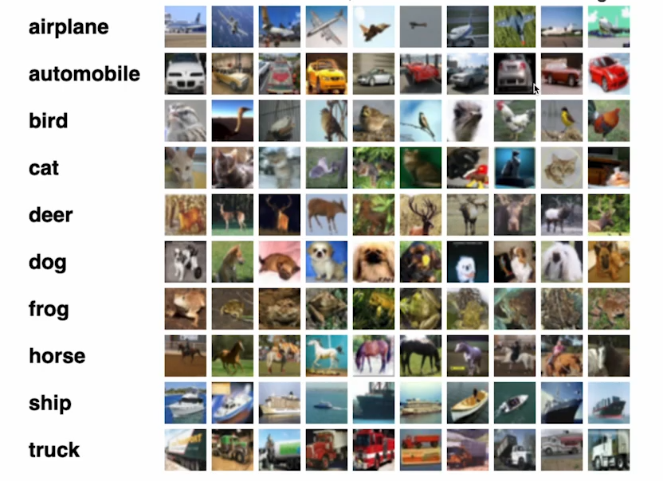
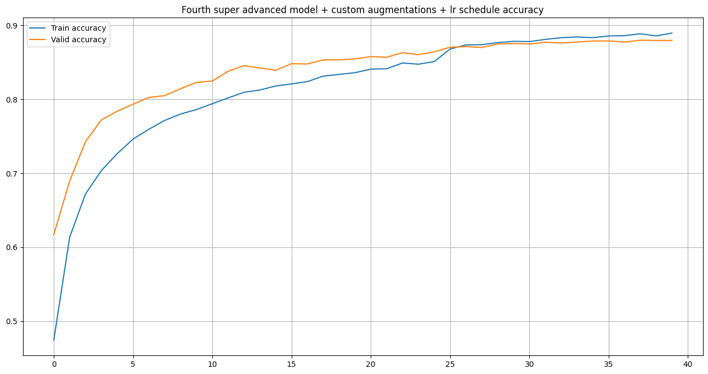
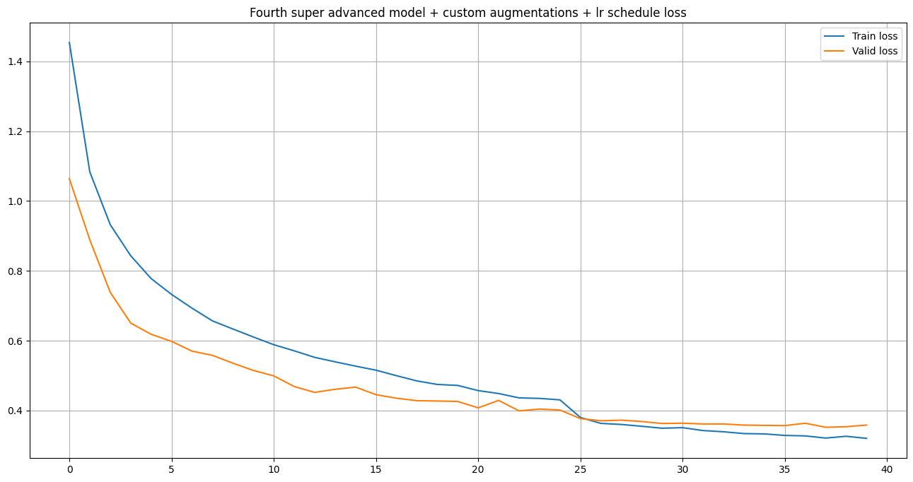

# CIFAR10_Neural_Network

Этот репозиторий посвящен обучению различных свёрточных нейронных сетей для классификации  изображений из датасета CIFAR-10 с использованием библиотеки PyTorch. CIFAR-10 — это популярный набор данных, содержащий 60 000 цветных изображений размером 32x32, разделенных на 10 классов. 

## Информация о датасете

## Цели проекта
1. **Загрузка и изучение структуры датасета CIFAR-10.**
2. **Выполнение нормализации изображений для улучшения качества обработки данных.**
3. **Визуализация примеров изображений.**
4. **Построение и обучение свёрточных нейронных сетей для классификации изображений.**

## Структура проекта
| Файл/Папка          | Описание                             |
|---------------------|-------------------------------------|
| `CIFAR_10.ipynb`    | Основной ноутбук проекта             |
| `images/`           | Папка с изображениями для примеров   |
| `README.md`         | Документация проекта                 |

## План ноутбука:
- **Изучение датасета CIFAR10**
- **Выполнение нормализации данных**
- **Написание необходимых для обучения функций**
- **Простая свёрточная нейронная сеть**
- **Более сложная сеть с большим количеством свёрточных слоёв, пулингом и увеличенным количеством фильтров.**
- **Добавление в сеть батч нормализации**
- **Добавление регуляризации для предотвращения переобучения**
- **Применение аугментаций к тренировочному датасету**
- **Использование scheduler при обучении**

А также добавлены все необходимые визуализации

## Результаты
Наилучшей оказалась модель номер 4 с применением различных аугментаций и scheduler

### График точности для свёрточной модели 4(CONV)

### График потерь для свёрточной модели 4(CONV)

## Дополнительные материалы
- [Документация PyTorch](https://pytorch.org/docs/stable/index.html) — Официальная документация PyTorch, включая описание работы с моделями, оптимизаторами, загрузчиками данных и многим другим.
- [Документация torchvision.datasets.CIFAR10](https://pytorch.org/vision/stable/datasets.html#cifar) — Руководство по загрузке и работе с датасетом CIFAR-10.
- [Руководство по обучению CNN на PyTorch](https://pytorch.org/tutorials/beginner/blitz/cifar10_tutorial.html) — Пошаговое руководство по созданию и обучению сверточных нейронных сетей на примере CIFAR-10.
- [Визуализация данных в Matplotlib](https://matplotlib.org/stable/tutorials/introductory/pyplot.html) — Официальное руководство по использованию библиотеки Matplotlib для визуализации данных.

